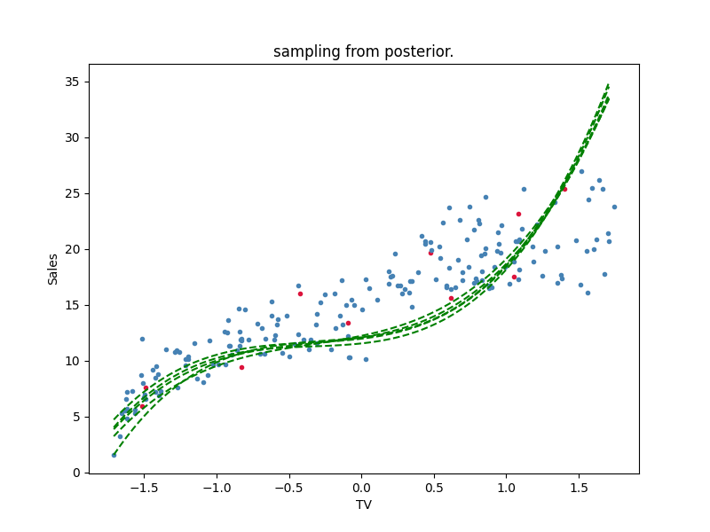

# Beyes Linear Regression

## Features

- Calculate posterior using data
- Post-event random sampling
- Works with multi-dimensional or single-dimensional input dimensions.

## Motivation

I found that there are surprisingly few correct implementations of Bayes linear regression, so I uploaded this implementation to Git.
In particular, there are many one-dimensional implementations, but they are not compatible with multiple dimensions. My code also supports that.
Notation follows PRML description.

## Example (Linear)

### Input Data

Here we use the famous advertising dataset as an example. First is a one-dimensional example.
The horizontal axis shows TV advertising expenses, and the vertical axis shows sales. Red points are observation points and blue points are test data. Horizontal axis is standardized.


### Calculate Posterior

Using only this red dot(observation data), let's see the results of the beyes linear regression. Mathematically, update the mean and covariance matrix as follows: It uses exactly the same notation as PRML.

- 

- 

First, draw 5 regression lines randomly from the defined prior distribution. Since it is random, an appropriate line is drawn. It is easy to understand if you plot it with the actual data points.


Next, the posterior distribution is calculated using the observed data, and the results are randomly sampled. You can see that it follows the data.


In the code, write as follows. mu, S, beta are prior distribution parameters.The part that draws the line is omitted.

```python
params = beyes_linear_model.sampling_params(n=5)
draw lines()

beyes_linear_model = BeyesLinearRegression(mu, S, beta)
beyes_linear_model.calc_posterior(x_obs, y_obs)
params = beyes_linear_model.sampling_params(n=5)
draw lines()
```

### predictive distribution

The forecast distribution is calculated by the formula below.

- 
- 

It is a diagram with the predicted distribution on the horizontal axis. The light blue color represents one sigma.


## Example (Polynomial)

Let's do a polynomial regression that is exactly the same as the Example(linear) example.

Sampling from the prior distribution draws random polynomial lines. In the sample, it is a third-order polynomial.


It can be seen that the fit to the data is good after the posterior distribution calculation.



## Example (multi dimension)

Finally, a two-dimensional regression is performed. The procedure is exactly the same as the previous sample.

The input data is still an advertising dataset, but we are increasing radio as an input dimension.


Regress the 2D plane. Just as before, a random plane is sampled before learning, but a good plane is obtained after learning.


